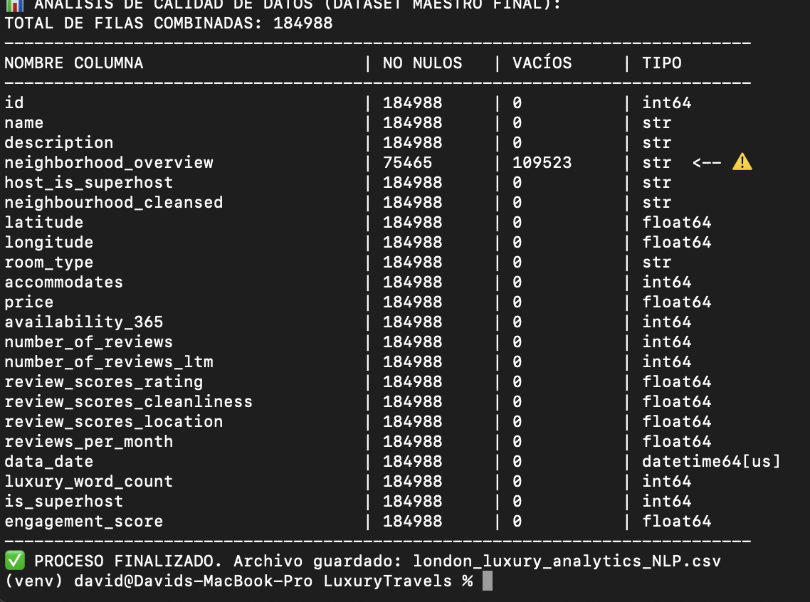
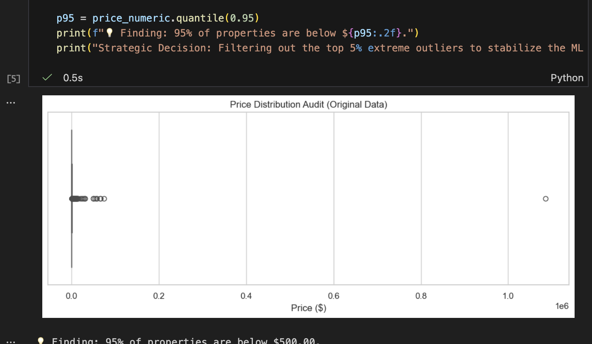
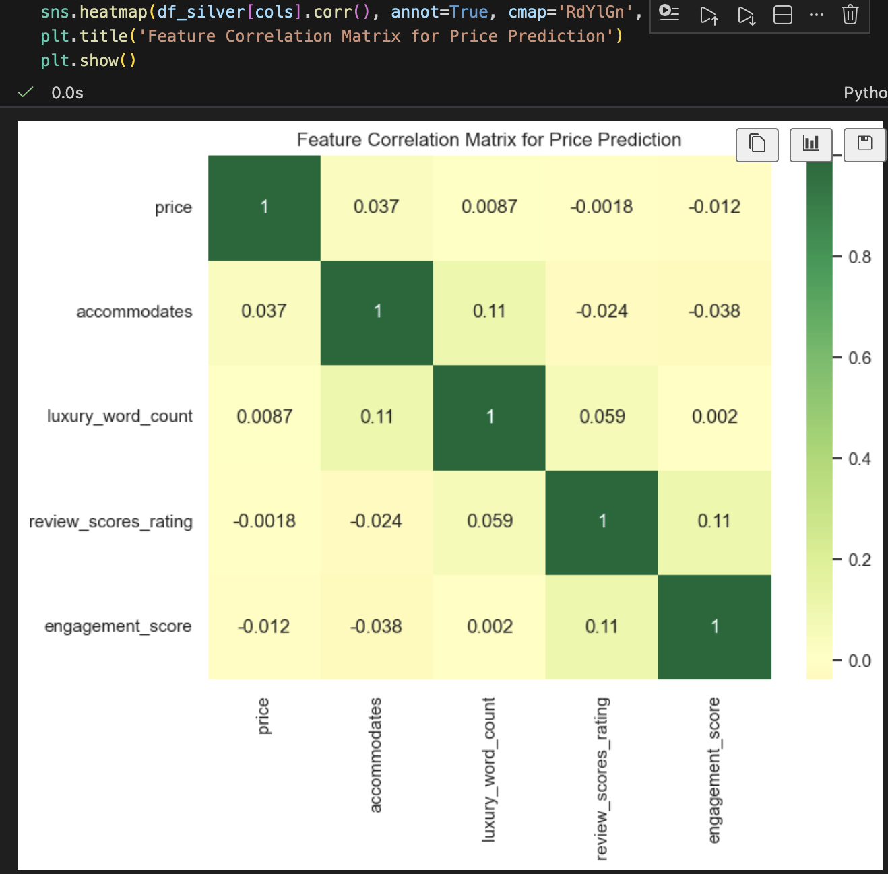
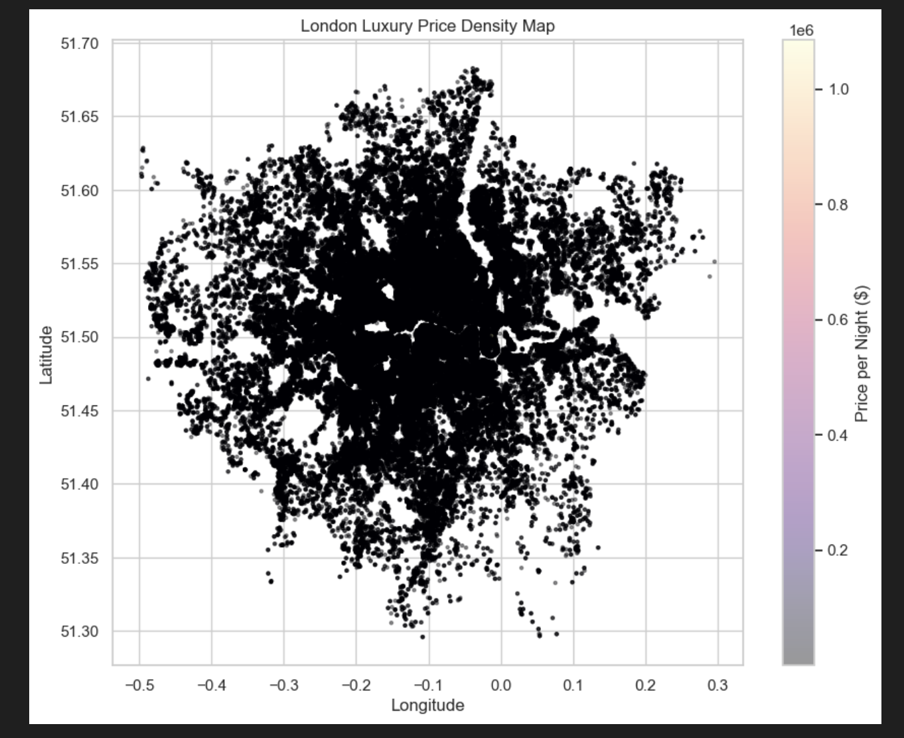
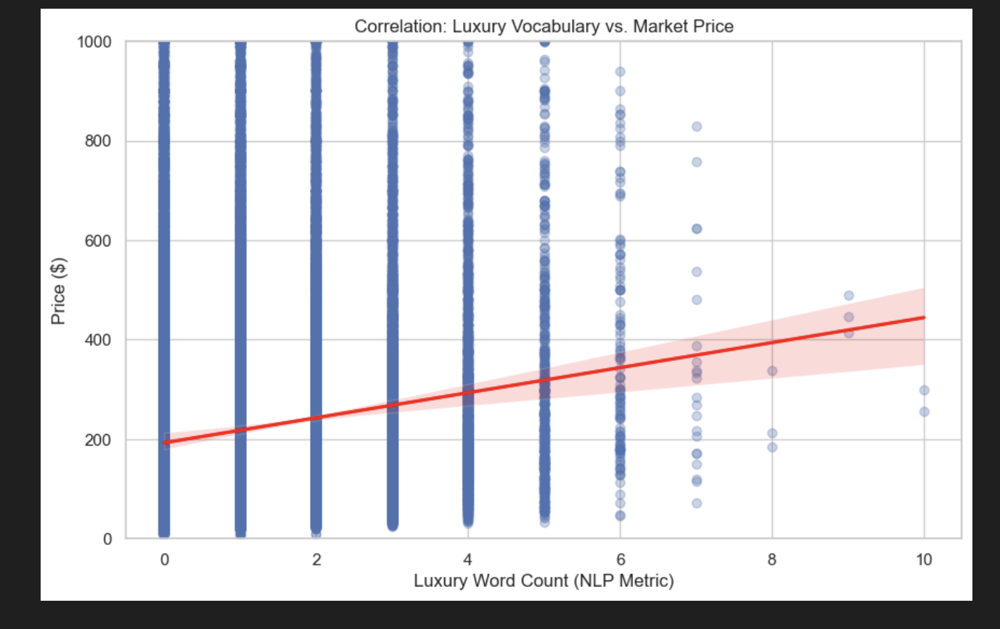
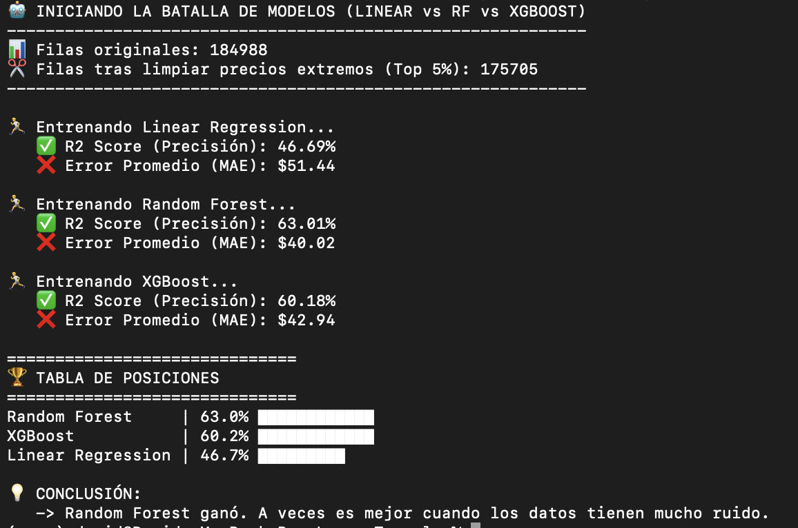
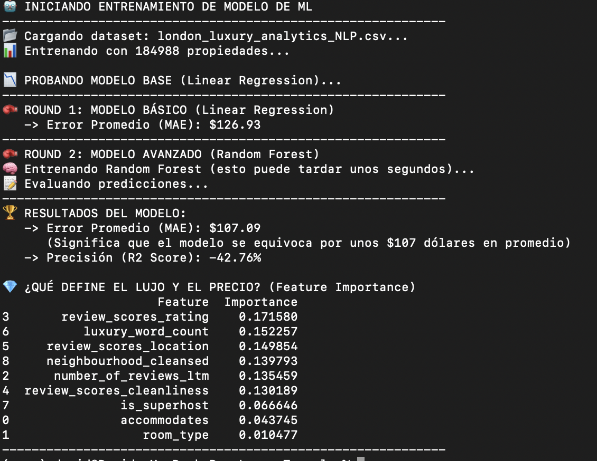
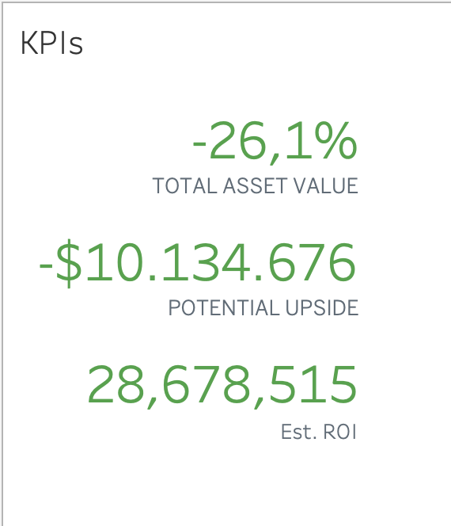
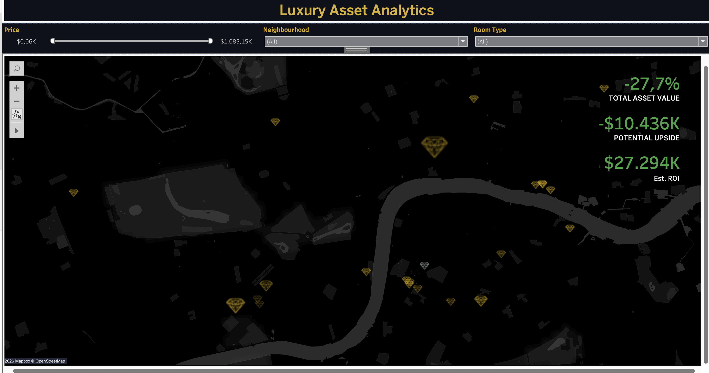

# 💎 London Luxury Market 🚀
### AI-Powered Valuation & Opportunity Engine for Luxury Travel

## 📋 Executive Summary
Designed for the **Luxury Travel Sector **, this project leverages **Machine Learning** and **Natural Language Processing (NLP)** to analyze the London short term rental market.

The system identifies **"Hidden Gems"**: properties with high-end amenities and luxury descriptors (NLP) that are currently undervalued by the market. This allows travel specialists to maximize margins and offer exclusive value to clients.

**🔗 [View Interactive Dashboard on Tableau Public](#)** https://public.tableau.com/app/profile/david.new1501/viz/LondonLuxuryRealEstateAnalysis/Dashboard?publish=yes

## 1. Data Processing & Analysis (Jupyter Notebooks)

Prior to visualization, a comprehensive **ETL (Extract, Transform, Load)** and **EDA (Exploratory Data Analysis)** process was conducted to ensure data integrity and quality.

### 🧹 Data Cleaning & Quality Control
I implemented logic to detect outliers and clean inconsistent records (e.g., properties with Price=0) to prevent bias in the pricing model.

| Cleaning Process | Outlier Detection |
| :---: | :---: |
|  |  |

### 📊 Market Analysis (EDA)
Exploration of correlations between key variables (price, reviews, location) and geospatial density of the properties to understand market dynamics.

**Correlation Matrix:**

**Geospatial Density & Vocabulary Analysis:**

---

## 2. Machine Learning Model (AI)

A **Random Forest** model was trained to predict the **"Fair Value"** of each property based on its features. This enables the calculation of the "Potential Upside" (Predicted Price vs. Actual List Price) to identify undervalued assets.

**Model Training:**

**Model Results & Metrics:**

---

## 3. Final Visualization (Tableau Dashboard)

The final output is the **Opportunity Engine Dashboard**. It is an interactive tool allowing investors to filter properties

### 🚀 Final Dashboard (Dark Mode)
Designed for high-level decision making, featuring a "Dark Mode" aesthetic. It highlights the **Top 50 Investment Opportunities** (Hidden Gems) rather than just the most expensive listings.

### Design Evolution
*Early iteration of KPIs vs. Final Version:*

---

## 🏗️ Data Architecture (Medallion Pattern)
This project follows industry-standard **Data Engineering** practices, structuring data flow into three layers:

    A -->[Bronze: Raw Data] -->|ETL Pipeline| B[Silver: Clean & Enriched]
    B -->|ML Training| Gold: Business Insights
    C -->|Deployment| Tableau Dashboard

## Environment Setup
# Clone the repository
git clone [https://github.com/your-username/luxury-market-intelligence.git](https://github.com/your-username/luxury-market-intelligence.git)

# Create virtual environment
python -m venv venv
source venv/bin/activate  # On Windows use: venv\Scripts\activate

# Install dependencies (includes pandas, scikit-learn, xgboost)
pip install -r requirements.txt
# Mac Users: Run 'brew install libomp' for XGBoost support
# lean data and extract NLP features
python src/etl_pipeline.py
# Train the AI model and save artifacts
python src/train_model.py
# Generate Business KPIs for Tableau
python src/generate_kpis.py

📊 Business Impact
* Automated Valuation: Replaces manual price checking with an instant AI benchmark.
* Inventory Optimization: Identifies overpriced assets to avoid and undervalued assets to target.
* Scalability: The pipeline handles new monthly data updates seamlessly.

## 💾 Data Access & Privacy

Due to GitHub's file storage limits (>100MB), the full dataset `data_core_dashboard.csv and london_luxury_analytics_NLP.csv` (142MB) is **not included** in this repository.

> **Engineering Note:** In a production environment, this data would be securely stored in a Data Lake (e.g., AWS S3, Google Cloud Storage) or a Data Warehouse (Snowflake), rather than in version control.